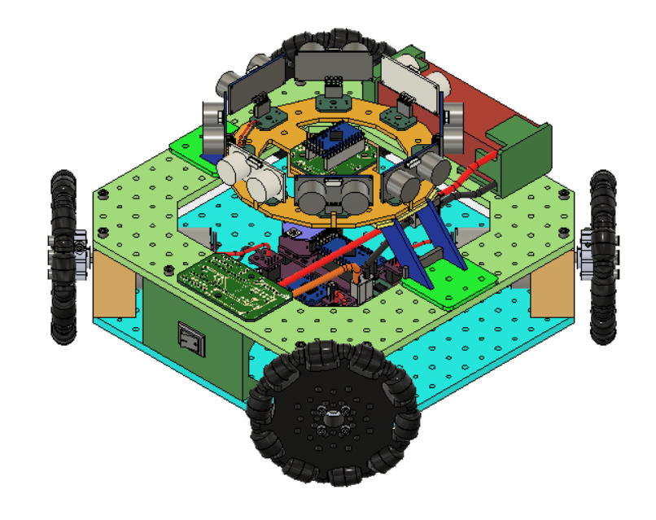

# Bluetooth Sonic Disk

This is for a version of the omnibot that uses the sonic disk https://github.com/richardFirth/sonicdisc on top of it to display the surroundings
using bluetooth.

Sonic Disk -> https://github.com/richardFirth/sonicdisc / https://platis.solutions/blog/2017/08/27/sonicdisc-360-ultrasonic-scanner/

Youtube video: https://www.youtube.com/watch?v=5h7yqy7BErE (crappy video - if there is interest I'll make a better one)

**CAD Model:**  https://grabcad.com/library/sonic-disk-mount-1   

  
