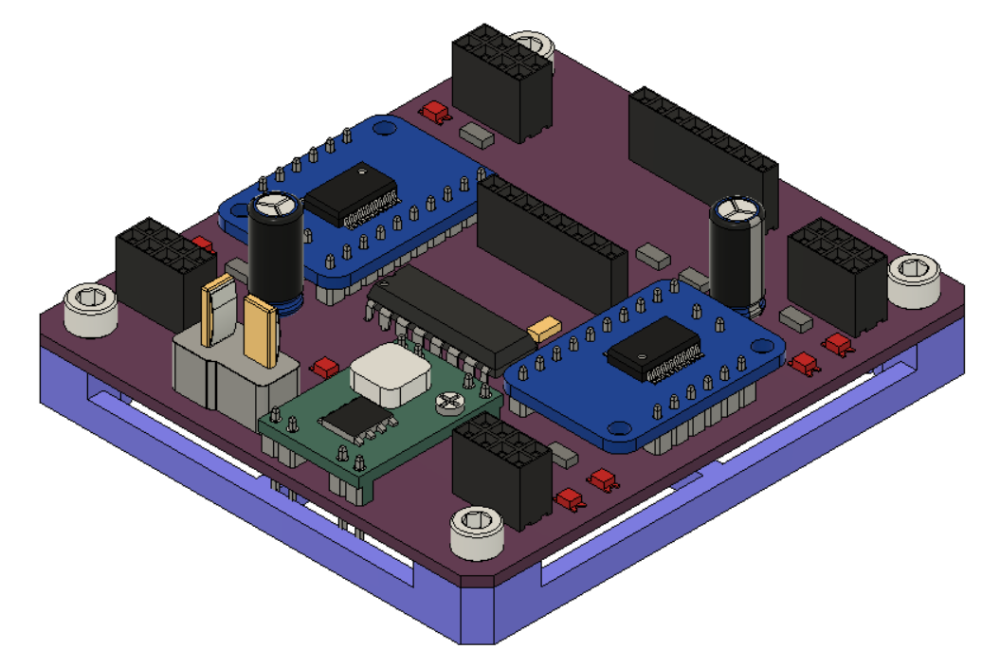

# Motor Board

Instructions for assembling the motor board.
This is used by each of the modules to control the motors of the omnibot.
It has a common output that can be used by whatever you put above it.

  
